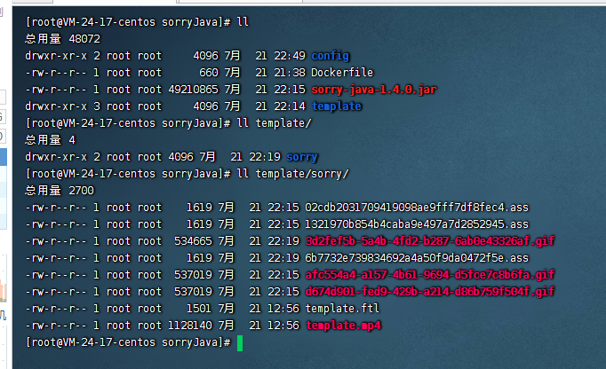
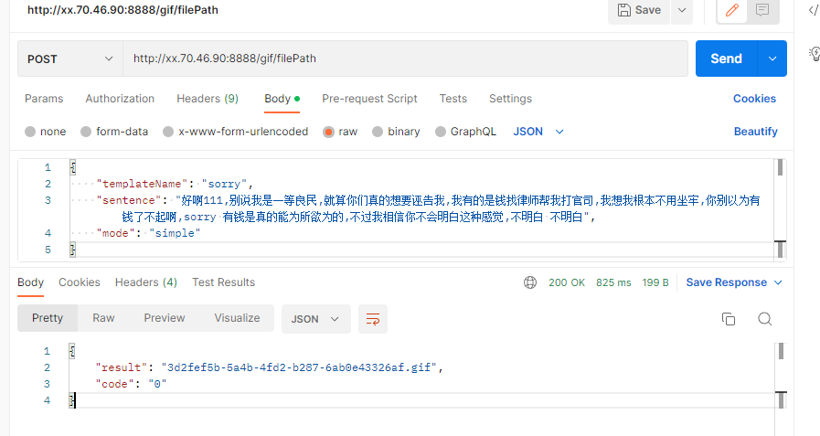

公众号


思路是参考[sorry](https://github.com/xtyxtyx/sorry)，原作是ruby写的，我就撸了个java 轮子，加了一点新功能，可以生成小一点的图片


优化点：
* 重构首页，方便移动端和PC端访问
* 首页素材全部CDN，加快加载速度
* 增加精简模式，可以生成几百k的用来做表情
* 将文件剥离出程序，可以动态切换


# sorryJava
sorry的java版本 操作演示


# 安装步骤

### docker (推荐)
首先安装 docker,不会的安装请自行百度


### 下载镜像

```bash
docker pull registry.cn-beijing.aliyuncs.com/kaigequ/javaffmpeg:v1
```
### 工作目录

### 启动  注意你的工作目录
```bash
docker run --rm -itd --name sorryjava -e QCLOUD_ENABLE=false \
-v /home/sorry/sorryJava:/opt/site  -p 8888:8888 \
registry.cn-beijing.aliyuncs.com/kaigequ/javaffmpeg:v1
```
 

### 访问 
http://ip:8888


### 请求示例


有问题欢迎提issue


